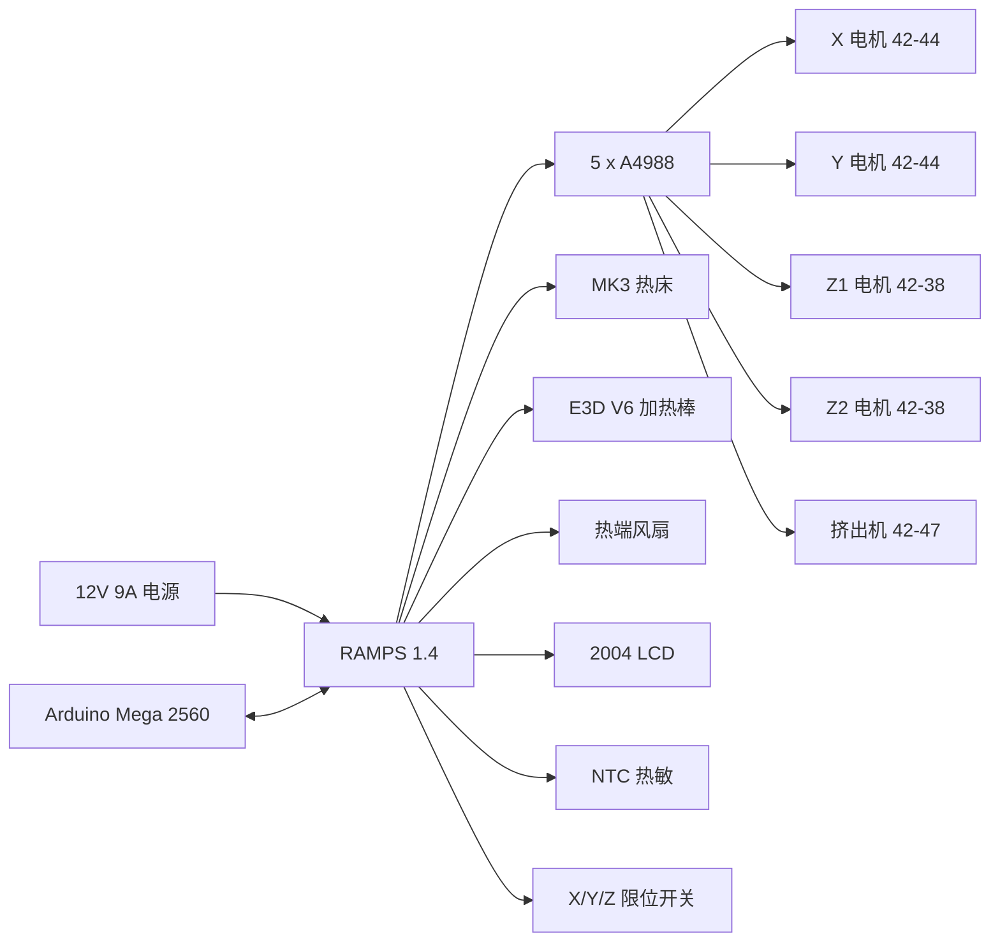

# 电气连接框图

```mermaid
flowchart LR
  PSU["12V 9A 电源"] --> RAMPS["RAMPS 1.4"]
  MEGA["Arduino Mega 2560"] <--> RAMPS
  RAMPS --> DRV["5 x A4988"]
  DRV --> X["X 电机 42-44"]
  DRV --> Y["Y 电机 42-44"]
  DRV --> Z1["Z1 电机 42-38"]
  DRV --> Z2["Z2 电机 42-38"]
  DRV --> E["挤出机 42-47"]
  RAMPS --> BED["MK3 热床"]
  RAMPS --> HOT["E3D V6 加热棒"]
  RAMPS --> FAN["热端风扇"]
  RAMPS --> LCD["2004 LCD"]
  RAMPS --> NTC["NTC 热敏"]
  RAMPS --> ENDSTOP["X/Y/Z 限位开关"]
```

- 5 个 A4988 分别对应 X、Y、Z1、Z2、挤出机。
- 热床、热端、风扇、NTC 与限位开关接入 RAMPS 的对应端口。
- 图中只表达模块级连接关系；具体引脚定义、主板跳线和固件配置不在本仓库范围内。
